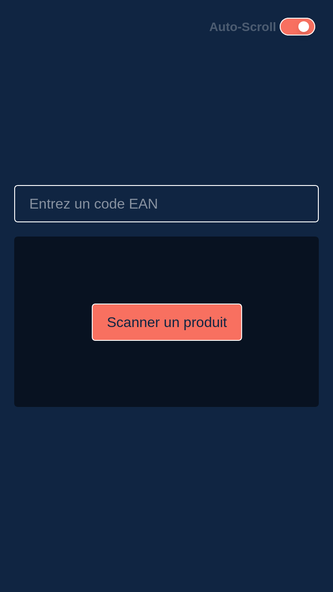
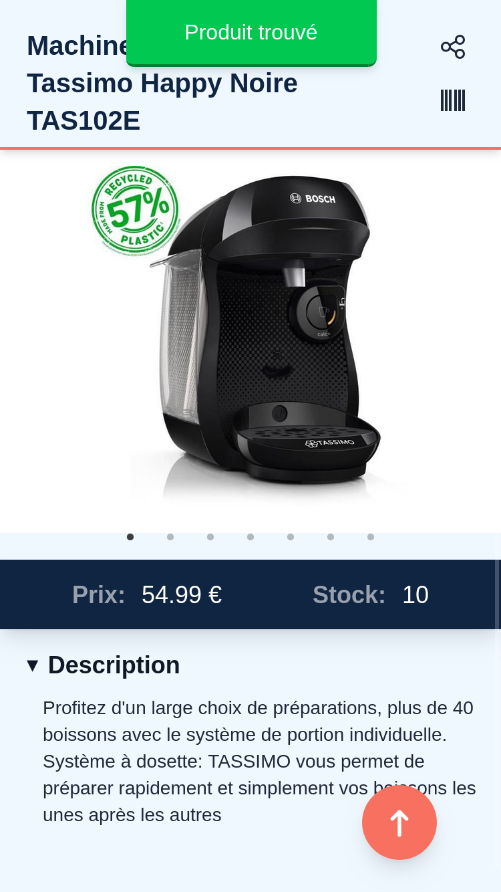

# E.Scan

Application web à destination des employés E.Leclerc pour consulter rapidement les stocks produits.

    

## Description

E.Scan est une application web conçue pour les employés des magasins E.Leclerc, leur permettant de vérifier rapidement la disponibilité des produits en scannant leur code-barres (EAN). L'application utilise l'API officielle d'E.Leclerc pour fournir des informations précises et en temps réel sur les stocks.

## Fonctionnalités
- Recherche de produits par EAN code
- Affichage des stocks en temps réel
- Partage de liens des produits

## Stack technique
- **Frontend** : Next.js, React, TailwindCSS
- **Backend** : Node.js, Express, E.Leclerc API
- **Hébergement** : VPS personnel (Nginx, PM2)

## Structure
- `client/` → Frontend Next.js
- `server/` → Backend Express API

## Données & RGPD
- Aucune donnée personnelle stockée
- Conforme au RGPD

## Captures d’écran

    
    

## Mentions légales
Ce projet est pensé et développé par **Luca Pourceau**.  
© 2025 Luca Pourceau — Tous droits réservés.
